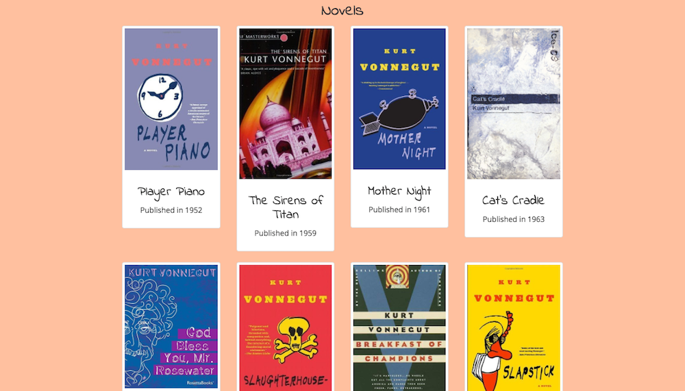

# TributePage
Basic Front End Development Project for FreeCodeCamp. 

I chose to create my tribute page on the writer Kurt Vonnegut. 

This page is intended to be functionally similar to [this example page](https://codepen.io/FreeCodeCamp/full/NNvBQW/). 

A codepen of my page can be found [here](https://codepen.io/vanillaSlice/full/zwdyLb/).

## Screenshots

